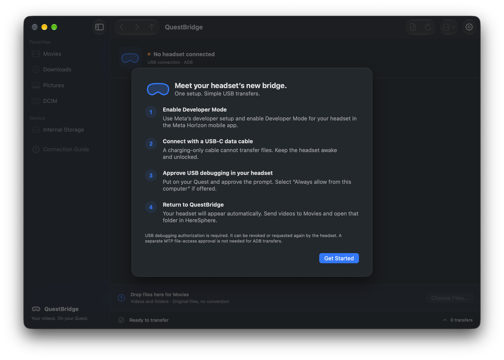

# QuestBridge

A native macOS 15.6+ file manager for Meta Quest headsets, built with Swift 6 and SwiftUI. All headset operations use ADB; MTP is not used.



## Download

The first downloadable release is being prepared. Signed builds will be published to [GitHub Releases](https://github.com/mingistech/QuestBridge/releases) after Apple notarization is complete. To install a published release, unzip it, move **QuestBridge.app** to **Applications**, and open it.

Requires macOS 15.6 or later. The release supports Apple Silicon and Intel Macs and includes official ADB tools, so no Homebrew or Android Studio installation is needed. USB debugging must be authorized on your headset before transferring files.

## Build from source

Open `QuestBridge.xcodeproj`, select the **QuestBridge** scheme and **My Mac**, and run. The existing signing team has been retained.

The built development application is at `build/Build/Products/Debug/QuestBridge.app`. This working copy includes official Google Platform Tools 37.0.1, including its Apple Silicon / Intel universal ADB executable, `NOTICE.txt`, and accompanying libraries. No Homebrew or Android Studio installation is needed.

For a fresh checkout, download the official macOS [Android Platform Tools](https://developer.android.com/tools/releases/platform-tools), extract it, and run:

```sh
Scripts/bundle-adb.sh /path/to/platform-tools
```

The Xcode Resources phase copies `Vendor/platform-tools` as a complete folder. Binary files are intentionally excluded from Git. The app also works without bundling: select an existing `adb` in **Settings → Connection**. Resolution order is bundled ADB, custom executable, then common Android SDK and Homebrew locations. A bundled executable takes precedence over the custom preference.

Enable Developer Mode on the headset, connect a USB data cable, and approve USB debugging in the headset. Select **Always allow from this computer** if offered. Authorization can be revoked or requested again; QuestBridge cannot bypass it.

## Using the app

- **Upload Videos** and the bottom drop target send files or folders to shared **Movies**, accessible from HereSphere.
- Dropping on a folder name or sidebar shortcut uses that destination. Empty browser-area drops use Movies.
- The File Actions menu can upload to the current folder or the default folder chosen in Settings. Destination folders must exist; create missing ones with **New Folder**.
- Double-click folders, use breadcrumbs, or use Back / Forward / Up to navigate shared storage.
- Select multiple rows to download or delete. Every deletion is confirmed, including recursive folder deletion.
- Sort using the sort menu; search filters the current folder. Return renames the selected item. ⌘O uploads, ⌘N creates a folder, ⌘R refreshes, and ⌘, opens Settings. ⌘A and ⌘Delete apply while the file browser has focus.
- The bottom queue expands to show completed, skipped, cancelled, and failed items. Cancel or retry individual transfers; retries restart from the beginning. History is kept for the running session.
- Name conflicts offer Replace, Skip, Keep Both, or Cancel, with a per-batch choice. **Replace replaces the whole item**, including folder contents. Settings can automatically skip or keep both; automatic replacement is deliberately unavailable.

## Transfer reliability

Transfers run serially; browsing remains available. ADB copies file contents directly without media processing or loading videos into application memory. Uploads and downloads go to uniquely named hidden staging items, are checked against a file-size manifest (including nested folders), and are then moved into their final names. Local upload sources are never deleted.

Replacement keeps the previous destination as a temporary backup until publication succeeds. No-clobber moves prevent an ordinary concurrent name conflict from silently overwriting an item. Each upload checks free space for the entire staged copy, including replacements. A failed copy is not published as a completed file.

An interrupted connection can leave `.questbridge-<UUID>.partial` or `.backup` items. Review them after reconnecting; a backup can contain the previous version. They remain visible in QuestBridge and can be renamed or deleted through its confirmed file operations. The application does not advertise resume support.

## Build and test

```sh
xcodebuild -project QuestBridge.xcodeproj -scheme QuestBridge \
  -configuration Debug -destination 'platform=macOS' \
  -derivedDataPath build CODE_SIGNING_ALLOWED=NO build
swift test
```

`Package.swift` builds the same core service sources used by the app, with Swift Testing tests in `Tests/QuestBridgeCoreTests`. Tests use mock ADB / filesystems for transfers and actual short-lived local processes to exercise pipe handling, timeouts, and cancellation. They do not contact or modify a headset.

## Architecture

- `QuestBridge/Core`: models, path validation, ADB resolution and process execution, device discovery and tracking, remote filesystem and storage parsing, staging / verification, and the serial transfer queue.
- `QuestBridge/ViewModels/MainViewModel.swift`: UI state, device selection, navigation, native file dialogs, preferences, diagnostics, and notifications.
- `QuestBridge/Views`: native table, settings, connection guide, conflict dialog, and expandable queue.
- `QuestBridge/ContentView.swift`: single-window navigation and device / storage / drop UI.
- `QuestBridge/MyApp.swift`: app lifecycle, menus, window persistence, and graceful shutdown.

The process runner launches `Process` with an argument array, drains both pipes independently, caps captured output, and handles cancellation / timeouts with termination and a kill fallback. Blocking Foundation process work runs on a background dispatch queue. Swift 6 strict concurrency is enabled. The small unchecked-Sendable process wrapper is protected by an explicit lock.

Device tracking parses four-byte hexadecimal length prefixes across arbitrary output chunks, with bounded retries and eight-second fallback polling. Devices must be identified from manufacturer/model/device properties before becoming browsable; unauthorized devices receive setup guidance without being falsely identified as a Quest. Device-specific operations always carry the serial number.

Remote enumeration uses NUL-delimited records rather than `ls` output. `stat` is probed with a `toybox stat` fallback. Remote shell operands are POSIX-quoted; no host shell executes application commands. Shared storage is resolved from `/sdcard` (or `EXTERNAL_STORAGE`) and checked against canonical paths. Symlink traversal and operations outside shared storage are rejected.

## macOS security and distribution

App Sandbox is disabled intentionally: the ADB child process needs USB access, a local shared server, existing ADB authorization keys, and selected filesystem paths. Hardened Runtime remains enabled. This is a personal-use, locally built application, not a Mac App Store sandboxed app. The existing signing configuration was preserved. QuestBridge never runs `adb kill-server`, changes USB functions, or stores ADB keys in the repository.

Development builds made with `CODE_SIGNING_ALLOWED=NO` are unsigned. Release packaging signs the application and bundled tools with Developer ID, submits them to Apple for notarization, and staples the accepted ticket before publication. See [release instructions](Documentation/Releasing.md). Google's complete notices and accompanying files are preserved; see `Vendor/platform-tools/README.md` for package provenance and the archive checksum.

## Current verification and limits

See [the verification record](Documentation/Verification.md) for exact build/test results and manual acceptance coverage.

- Progress is honestly **indeterminate** for the current pipe-based ADB connection. The UI shows the filename, total bytes when known, operation phase, and verified completion. Percentage, transferred-byte counts, speed, and ETA are not fabricated.
- Verification checks names, file types, and file sizes, not checksums. Equal-size content changes cannot be detected by size verification.
- Symbolic links, special files, protected Android storage, wireless ADB, transfer resume, media previews, and DeepFrame automation are outside this release.
- Directory metadata is bounded to 32 MiB per command; exceptionally large listings report an error rather than grow memory indefinitely.
- Remote filesystem operations rely on Android `readlink -f`, `stat` or `toybox stat`, and `mv -nT`. Unsupported utilities fail visibly. Names with spaces, Unicode, quotes, parentheses, and newlines are covered by tests.
- Window layout was inspected in the running native app. Full macOS 15 and Intel runtime testing, accessibility testing, and every hardware acceptance scenario still require manual validation.
